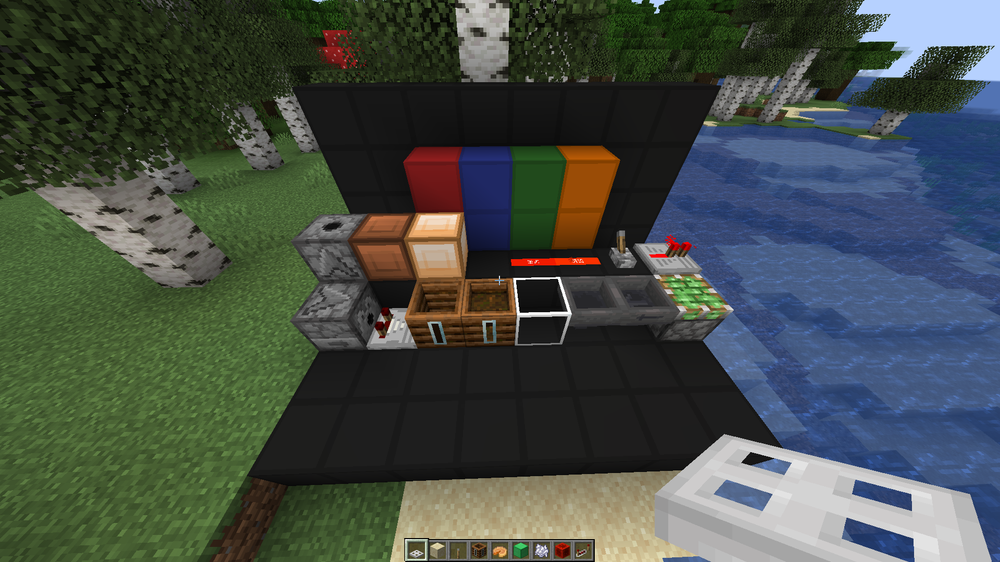

# MattPack
The texture pack used by mattbatwings.

[mattbatwings](https://www.youtube.com/@mattbatwings) did not create any of these textures. This is an accumulation of multiple packs such as [VanillaTweaks](https://vanillatweaks.net/picker/resource-packs/) and [Codecrafted](https://codecrafted.net/)

## Supported Versions: 1.18.2, 1.20.1
 * Versions other than the ones above will not get updates
### Features:
 * Iron trapdoors on the top block will be turned into lamps.
 * The Power Level of redstone dust is visible
 * Clean Wool & Glass
 * Clean Repeater and Comparater
 * Hopper & Observer Arrows
 * Composters show how full they are on the side
